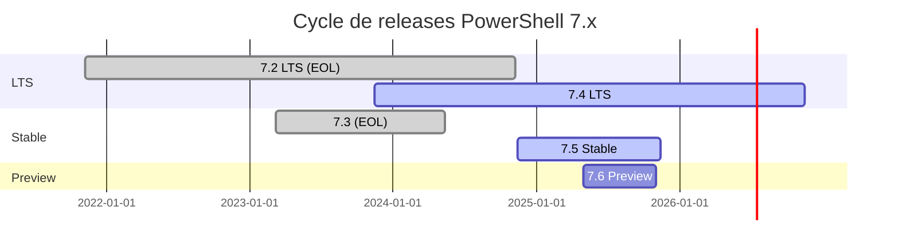

# Introduction à PowerShell

## 🎯 Objectif du module

À l'issue de cette introduction, vous devez comprendre :

- Pourquoi PowerShell est devenu incontournable pour l'automatisation
- Comment il a évolué jusqu'à la version 7.5 (stable) / 7.6 (preview)
- En quoi il dépasse l'invite de commandes (et même Bash dans certains cas)

## 1. PowerShell en un clin d'œil

### Versions actuelles

| Version | Canal | Date | Socle .NET |
|---------|-------|------|------------|
| 7.5.2 | Stable | 24 juin 2025 | .NET 9.0.301 |
| 7.6-preview 4 | Preview | mai 2025 | .NET 9.0.101 |

**Références :**
- [endoflife.date](https://endoflife.date/powershell)
- [learn.microsoft.com](https://learn.microsoft.com/en-us/powershell/)

> **💡 Astuce**
>
> En environnement de production, préférez toujours la dernière LTS (actuellement 7.4) si vous avez besoin d'un support prolongé ; optez pour la branche « Stable » (7.5.x) pour profiter des nouveautés, ou pour la Preview (7.6) si vous souhaitez tester ce qui arrive prochainement.
>
> **Référence :** [endoflife.date](https://endoflife.date/powershell)

## 2. Une (courte) histoire de PowerShell

```mermaid
gitgraph
    commit id: "2003: Projet Monad"
    commit id: "2006: PowerShell 1.0 (Windows)"
    commit id: "2009: PowerShell 2.0 — Remoting"
    commit id: "2012: PowerShell 3.0 — Workflows"
    commit id: "2014: PowerShell 4.0 — DSC"
    commit id: "2016: PowerShell 5.0/5.1 — OneGet"
    branch core
    checkout core
    commit id: "2016: PowerShell Core 6.0 — Open Source"
    commit id: "2020: PowerShell 7.0 — Fusion"
    commit id: "2023: PowerShell 7.4 (LTS) — .NET 8"
    commit id: "2025-06: PowerShell 7.5.2 (Stable)"
    commit id: "2025-05: PowerShell 7.6-preview 4"
```

### Jalons importants

- **2003-2006 : naissance (Projet "Monad")**  
  Premier shell orienté-objet pour Windows.

- **2009 : v2 et le remoting**  
  Administration distante sécurisée. (La base de WinRM que vous utiliserez encore aujourd'hui.)  
  [📖 learn.microsoft.com](https://learn.microsoft.com/en-us/powershell/scripting/learn/remoting/running-remote-commands)

- **2012-2014 : v3/v4**  
  Workflows + DSC → premiers pas vers l'Infrastructure as Code.

- **2016 : v5.1**  
  Dernière mouture de Windows PowerShell (arrêt des nouveautés).  
  [📖 learn.microsoft.com](https://learn.microsoft.com/en-us/powershell/scripting/windows-powershell/whats-new/what-s-new-in-windows-powershell-50)

- **Août 2016 : PowerShell devient open source & multiplateforme**  
  Extension vers Linux et macOS.  
  [📖 devblogs.microsoft.com](https://devblogs.microsoft.com/powershell/)

- **2020-2025 : cycle 7.x**  
  Convergence, rythme semestriel, intégration .NET 8 puis .NET 9, amélioration des performances et de la compatibilité modules.

## 3. PowerShell vs invite de commande : le match

| Caractéristique | cmd.exe | PowerShell 7.x |
|-----------------|---------|----------------|
| **Paradigme** | Flux texte | Flux objets .NET |
| **Conventions** | Commandes hétérogènes | Cmdlets Verbe-Nom auto-documentées |
| **Pipelines** | Chaînes à parser | Objets typés → filtrage, tri, export natifs |
| **API** | Aucune | .NET, COM, WMI, REST |
| **Administration distante** | Minimal | Invoke-Command, SSH, Azure Cloud Shell |
| **Sécurité** | ACL classiques | Politiques d'exécution + signature de scripts |
| **Multiplateforme** | Windows uniquement | Windows, Linux, macOS |

> **🚀 Résultat**
>
> Pour les scripts de production, PowerShell réduit le code « colle » (parse/regex) de 30-50 % en moyenne, tout en restant lisible pour vos équipes Ops.

## 4. Pourquoi apprendre PowerShell en 2025 ?

### Avantages clés

- **Automatisation massive** – CI/CD, déploiements (GitHub Actions, Azure DevOps), tâches planifiées
- **Interop .NET & REST** – un seul outil pour manipuler AD, Azure, SQL Server, Kubernetes…
- **Administration à distance** – gère des centaines de serveurs via session remoting ou SSH
- **Cross-platform ready** – même script sur Windows Server, Ubuntu et macOS
- **Communauté et modules** – plus de 10 000 modules sur PSGallery, mises à jour continues
- **Écosystème Microsoft** – la plupart des nouveaux produits (Teams, Entra ID, Azure) fournissent d'abord un module PowerShell… puis seulement une GUI
- **Support entreprise** – releases LTS (7.2, 7.4) maintenues ≥ 3 ans

### 📚 Pour aller plus loin

- [Differences from Windows PowerShell](https://learn.microsoft.com/en-us/powershell/scripting/whats-new/differences-from-windows-powershell) - learn.microsoft.com
- [Migration guide 5.1 → 7.x](https://learn.microsoft.com/en-us/powershell/scripting/install/migrating-from-windows-powershell-51-to-powershell-7) - learn.microsoft.com

## 5. Points clés à retenir

### ✅ À mémoriser

- **Windows PowerShell 5.1** reste dans Windows, mais ne reçoit plus de nouvelles fonctionnalités
- **PowerShell 7.x** est le futur : open-source, multiplateforme, supporté via un cycle Stable / LTS
- **Apprendre PowerShell**, c'est investir dans un langage objets orienté-automatisation qui s'intègre partout dans l'écosystème Microsoft… et au-delà

### Cycle de releases PowerShell 7.x



---

**Prochaine étape :** Installation et premiers pas avec PowerShell 7.x
